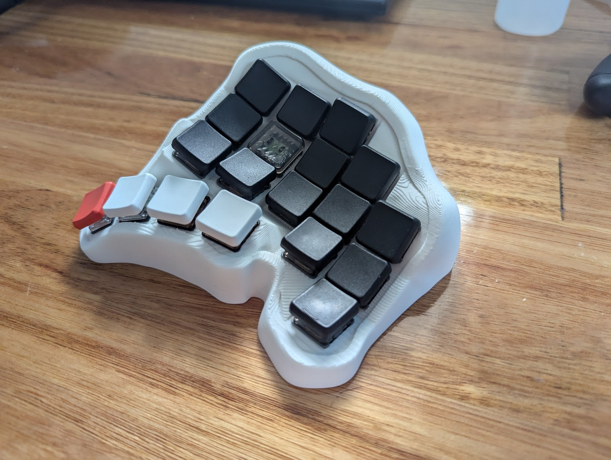

# Cosmos V5

Evolution of trying
- PCB Corne: Too flat, hands having  to stretch especially pinky.
- PCB Chocfi: Btter but still not quite right & still too flat. Key risers showed the benefits of curved columes but make key strikes at an angle to the switch.
- 5 different cosmos designs & prints using [ryanis.cool/cosmos](https://ryanis.cool/cosmos) finally ending up with [V5](https://ryanis.cool/cosmos/beta#cm:CqIBChsSBxCQQSATQAMSABIAODFApYSFDUi+j+i+oDkKIRILEJBNIBNABEiA8AYSBEiAmAYSADgdQIXwzQ5Iko/MAQoZEgUQkFkgExIAEgMQsC84CUCDoIr4HkiGEwoYEgUQkGUgExIAEgYQsDtAgAI4CkCDhtQOChoSBRCQcSATEgASADgeQI6Oi+gaSLKFlKbQDBgAQOiFoK7w0QFIupfgvaBTCpoBCh8SExDAgAJAkKSYAUjCmaCVkLwBUEM4CECApBhIgLgKChoSEBBAQJmwLUjcm4DtsNYBUAtAlICUAVCeAgoZEhEQQECm1MABSKSb1J2QtwFQV0CAgChQfwoDUIICChsSERAwQKuInA1IkJHAhdGcA1ALQJSAlAFQ5gMYAiIMCL4BEMEBGOcCILQBQMuLvJaw/AFIrZHcjcGTBhADGIsgIgwIsQEQrQEYjgIglhAoCjAtOAOCAQQEggEASABYBmADaAByEg0AACBBIAAoEzAVOA9AHnjeBw==)

[QMK Code](https://github.com/inetd404/qmk_firmware/tree/cosmosv5)

# Prior Designs
## V4

