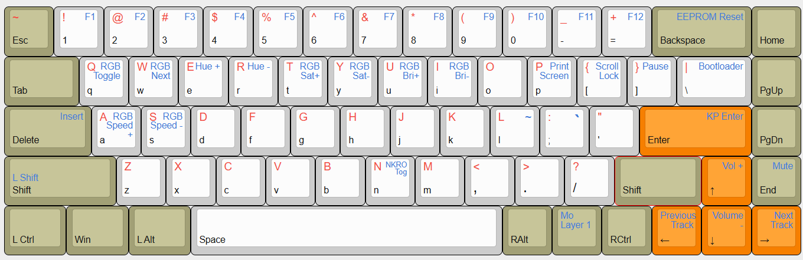

# Custom KDBFans dz68rgb v3 Board 

First custom keyboard I assembled from parts.

- [KDB Fans 65% RGB Board](https://kbdfans.com/products/dz68rgb-hot-swap-rgb-pcb?_pos=1&_psq=dz65+rgb&_psid=88076bebf&_ss=e&_v=1.0)
- Tofu65 Aluminium 65% case
- PBT SA Control Code keycaps
- Gateron Ink V2 switches
- [QMK Code Branch](https://github.com/inetd404/qmk_firmware/tree/dz65rgb-damo)

# Layout

